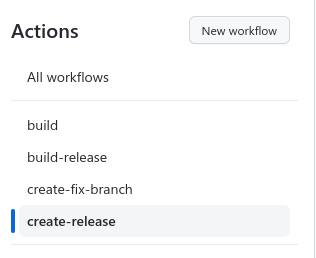
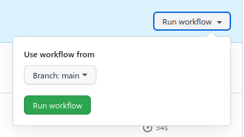
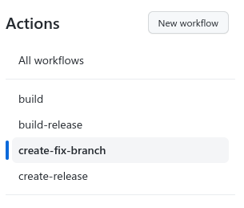
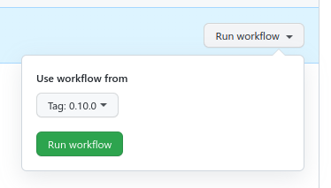

# Onecx java library Github Actions

Onecx java library actions

* build.yml - build the java project. 
* build-release.yml - build and publish the java project.
* create-fix-branch.yml - create a fix branch for existing release (tag x.x.0). This action requires a personal access token with scopes `admin:repo_hook, repo` and name `CI_PAT`
* create-release.yml - create a new release (tag x+1.x.0 or x.x+1.0  for main branch, x.x.x+1 for fix branch). This action requires a personal access token with scopes `admin:repo_hook, repo` and name `CI_PAT`

## How to use it in the project

### Build project

Create `.github/workflows/build.yml` file for `main` branch build and `pull_request`.

```yaml
name: build
on:
  push:
    branches:
      - 'main'
  pull_request:

jobs:
  java:
    uses: onecx/ci-java-lib/build.yml@v1
    secrets: inherit
```

### Build release

Create `.github/workflows/build-release.yml` file for `tag` build and deploy.

```yaml
name: build-release
on:
  push:
    tags:
    - '**'
jobs:
  java:
    uses: onecx/ci-java-lib/build-release.yml@v1
    secrets: inherit
```

Build release by default generate a `changelog` in the project. Create a file `.github/changelog.yaml`
For example:

`````yaml
sections:
- title: Major changes
  labels:
    - "release/super-feature"
- title: Complete changelog
  labels:
    - "bug"
    - "enhancement"
    - "dependencies"
template: |
  Plugin maven dependency:
  ```xml
  <dependencyManagement>
      <dependencies>
          <dependency>
              <groupId>_project-group-id_</groupId>
              <artifactId>_project-artifact-id_</artifactId>
              <version>{{ .Version }}</version>
              <type>pom</type>
              <scope>import</scope>
          </dependency>
      </dependencies>
  </dependencyManagement>  
  ```
  {{ range $section := .Sections }}{{ if $section.Items }}### {{ $section.GetTitle }}{{ range $item := $section.Items }}
  * [#{{ $item.GetID }}]({{ $item.GetURL }}) - {{ $item.GetTitle }}{{ end }}{{ end }}
  {{ end }}
`````

More documentation in the [changelog](https://github.com/lorislab/changelog) page.

> Changelog could be disabled by setting the inteput `changelog` to `false`.

### Create release

> This is manual action.

Create `.github/workflows/create-release.yml` file for create a release actions.

```yaml
name: create-release
on:
  workflow_dispatch:
jobs:
  release:
    uses: onecx/ci-java-lib/create-release.yml@v1
    secrets: inherit
```

To create a release open the project page `Actions` and select `create-release` action from the list.



Select a branch to create a new release for and run the workflow.



### Create fix branch

> This is manual action.

Create `.github/workflows/create-fix-branch.yml` file for create fix branch actions.

```yaml
name: create-fix-branch
on:
  workflow_dispatch:
jobs:
  fix:
    uses: onecx/ci-java-lib/create-fix-branch.yml@v1
    secrets: inherit
```

To create a fix branch open the project page `Actions` and select `create-fix-branch` action from the list.



Select a tag `x.x.0` to create a new fix branch for and run the workflow.

